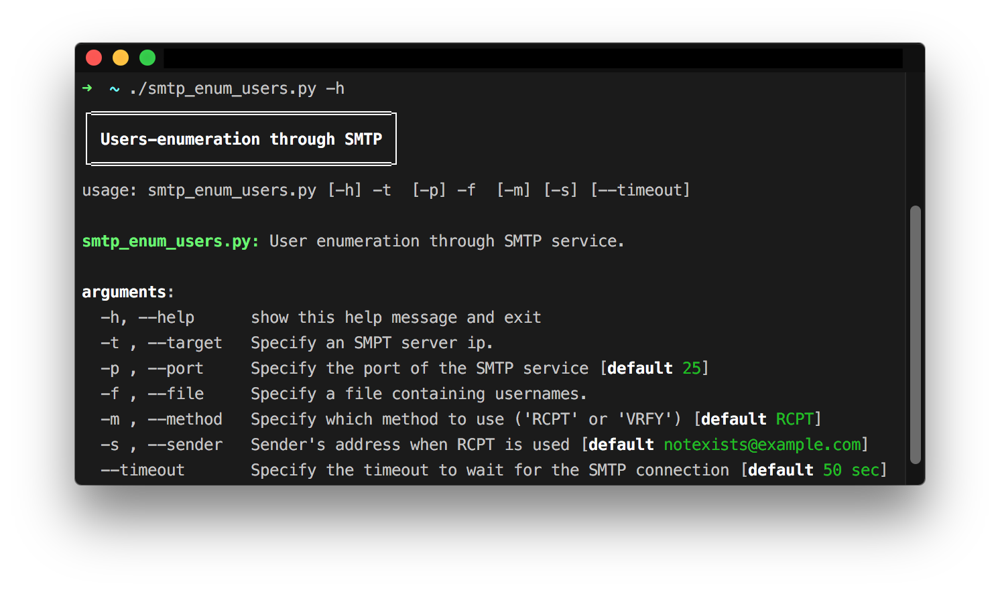

# smtp_enum_users  

This is a python script to automate the process of enumerating usernames through SMTP service. To do that it uses either `RCPT` method (default) or `VRFY` method. The default method used is `RCPT` since the most SMTP servers have the `VRFY` command disabled.

**Requirements:**

*   [colorama](https://pypi.python.org/pypi/colorama)

**Note:** To install the requirements:

`pip install -r requirements.txt --upgrade --user`

### Disclaimer
> This tool is only for testing and academic purposes and can only be used where strict consent has been given. Do not use it for illegal purposes! It is the end user’s responsibility to obey all applicable local, state and federal laws. Developers assume no liability and are not responsible for any misuse or damage caused by this tool and software.

## License

This project is licensed under the GPLv3 License - see the [LICENSE](LICENSE) file for details